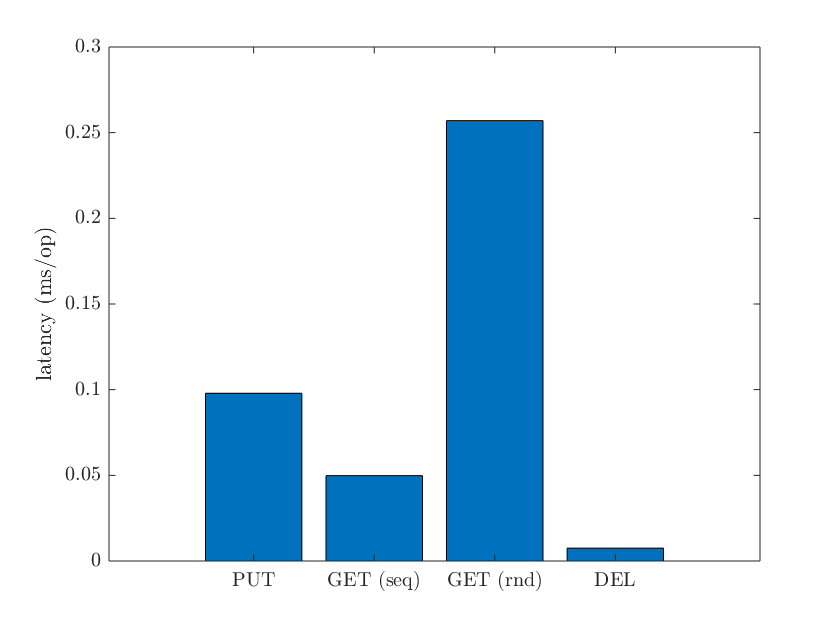
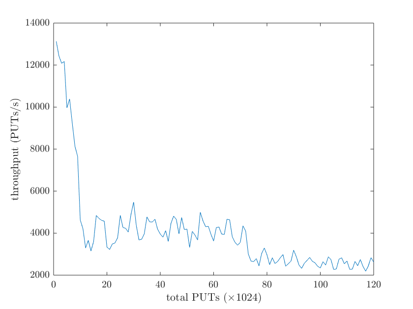

# LSMTree
## 设计
### 文件结构
```
|-- LSMTree
	|-- dep							// 依赖
		|-- snappy					// snappy库源代码(https://github.com/google/snappy)
			|-- ...
	|-- doc							// 文档
		|-- LSMTree.md				// 本文档
		|-- ...
	|-- include						// 头文件
		|-- BlockCache.h			// 块缓存
		|-- DiskStorage.h			// 磁盘存储
		|-- Entry.h					// 键值对
		|-- KVStore.h				// 键值对数据库
		|-- KVStoreAPI.h			// 键值对数据库接口
		|-- LevelNonZero.h			// 非0层
		|-- LevelZero.h				// 第0层
		|-- Option.h				// 参数
		|-- SearchResult.h			// 搜索结果
		|-- SkipList.h				// 跳表
		|-- SSTable.h				// SSTable
		|-- SSTableId.h				// SSTable地址
		|-- TableCache.h			// 输入流缓存
		|-- Util.h					// 公用函数
	|-- src							// 源文件 (头文件的实现)
		|-- ...
	|-- test						// 测试代码
		|-- Test.h					// 测试类
		|-- correctness.cpp			// 正确性测试
		|-- persistence.cpp			// 持久性测试
		|-- latency.cpp				// 时延测试
		|-- throughput.cpp			// 吞吐量测试
		|-- ...
	|-- CMakeLists.txt
	|-- ...
```
### 整体数据结构
<div style="display: flex; justify-content: center">
	
</div>

### 参数
&emsp;&emsp;参数定义在`Option`名称空间下.
| 参数 | 类型 | 含义 |
| - | - | - |
| `COMPRESSION` | `bool` | 是否采用压缩机制 |
| `COMPACTION` | `bool` | 是否采用合并机制 |
| `BLOCK_CACHE` | `bool` | 是否采用读缓存机制 |
| `TABLE_CACHE` | `bool` | 是否采用输入流缓存机制 |
| `SST_SPACE` | `uint64_t` | SSTable的大小(以字节计) |
| `BLOCK_SPACE` | `uint64_t` | SSTable中的块的大小(以字节计) |
| `BLOCK_CACHE_SPACE` | `uint64_t` | 块缓存的大小(以字节计) |
| `TABLE_CACHE_SIZE` | `uint64_t` | 输入流缓存的大小(以个数计) |
| `NZ_NUM` | `uint64_t` | 非0层数 |
| `Z_SPACE` | `uint64_t` | 第0层的大小(以字节计) |
| `NZ_SPACES` | `uint64_t`数组 | 各个非0层的大小(以字节计) |
| `Z_NAME` | `const char*` | 第0层的名字 |
| `NZ_NAMES` | `const char*`数组 | 各个非0层的名字 |

### 转储操作
&emsp;&emsp;`SkipList`中的数据量达到`Option::SST_SPACE`时, 通过`LevelZero::add`方法将`SkipList`中的键值对转储至第0层.
<div style="display: flex; justify-content: center">
	
</div>

### 合并操作
&emsp;&emsp;上层向下层合并时, 首先调用上层的`LevelZero::extract`或`LevelNonZero::extract`方法, 将上层中一些`SSTable`中的键值对合并入一个`std::vector<Entry>`类型的列表并删除这些`SSTable`, 然后调用下层的`LevelNonZero::merge`方法, 将列表中的键值对合并入下层.
<div style="display: flex; justify-content: center;">
	
	
	
</div>

&emsp;&emsp;`LevelZero::extract`, `LevelNonZero::extract`与`LevelNonZero::merge`中都使用了`Util::compact`函数, 其函数原型如下.
```C++
/* util.h */
namespace Util {
    std::vector<Entry> compact(const std::vector<std::vector<Entry>> &inputs);
}
```
&emsp;&emsp;`Util::compact`函数的输入`inputs`中的每个元素都是一个无重复键的键值对列表, 这些列表都是按照键的大小从小到大排列的. `Util::compact`函数会将这些键值对列表合并为一个键值对列表, 当一个键在多个列表中出现时, 以`inputs`中序号较大的列表为准.

### 磁盘搜索操作
<div style="display: flex; justify-content: center">
	
	
</div>

### SSTable格式
&emsp;&emsp;将一个无重复键的键值对列表转换为SSTable需要通过以下步骤. 第一步, 按照键从小到大的顺序将值连接起来, 并计算偏移量`offset`.
<div style="display: flex; justify-content: center">
	
</div>
第二步, 将连接起来的值按照每块`Option::BLOCK_SIZE`个字节分为若干块(每块包含的字节数不一定均为`Option::BLOCK_SIZE`, 一个值不能被分入两个块), 并计算偏移量`ori`.
<div style="display: flex; justify-content: center">
	
</div>
第三步, 压缩各个块得到最终SSTable中的`CompressedBlock`段, 并计算偏移量`cmp`. 如果`Option::COMPRESSION`为`false`, 压缩后的块与原有的块相同.
<div style="display: flex; justify-content: center">
	
</div>
最终得到包含`EntryIndex`, `BlockIndex`与`CompressedBlock`三段的SSTable. `EntryIndex`段由键值对的个数`n`, 键`key`与偏移量`offset`构成. `BlockIndex`段由块的个数`n`, 偏移量`ori`与偏移量`cmp`构成.
<div style="display: flex; justify-content: center">
	
</div>

### 压缩与分块
&emsp;&emsp;若将一个SSTable的所有值全部连接起来以后一起压缩, 那么读取SSTable中的一个键值对时需要从磁盘读入整个压缩块, 严重影响了`GET`性能, 所以采用分块压缩的策略.

### 缓存
&emsp;&emsp;`BlockCache`与`TableCache`都是LRU缓存(基于链表+哈希表实现).

&emsp;&emsp;`BlockCache`缓存的是SSTable中的块, 缓存缺失时利用`SSTable::loadBlock`读取相应块.

&emsp;&emsp;`TableCache`缓存的是SSTable的输入流, `SSTable::loadBlock`需要利用`TableCache::open`来获取输入流以读取磁盘.

## 性能测试
### 测试环境
| 环境参数 | 值 |
| - | - |
| 处理器 | Intel Core i7-8550U |
| 内存大小 | 8.00GB |
| 硬盘 | KXG50ZNV256G NVMe TOSHIBA 256GB |
| 操作系统 | Windows 10.0.18362 |
### 时延测试
#### 测试方法
&emsp;&emsp;为区间$[0, 128 \times 1024)$中的每个键各生成一个随机的小写字母字符串作为值, 值的长度在$10000$与$20000$之间均匀分布. 顺序`PUT`这些键值对, 然后顺序`GET`这些键值对, 然后乱序`GET`这些键值对, 最后顺序`DEL`这些键值对("顺序"指按照键的大小从小到大). 统计`PUT`, 顺序`GET`, 乱序`GET`与`DEL`的平均用时.
#### 参数设定
| 参数名 | 值 |
| - | - |
| `COMPRESSION` | `true` |
| `COMPACTION` | `false` |
| `BLOCK_CACHE` | `true` |
| `TABLE_CACHE` | `true` |
| `SST_SPACE` | `2 * 1024 * 1024` |
| `BLOCK_SPACE` | `4 * 1024` |
| `BLOCK_CACHE_SPACE` | `2 * 1024 * 1024` |
| `TABLE_CACHE_SIZE` | `5` |

#### 测试结果
<div style="display: flex; justify-content: center">
	
</div>

#### 分析
&emsp;&emsp;`PUT`总共写入的数据量与`GET`总共读取的数据量基本相同, 但测试表明`PUT`, 顺序`GET`, 乱序`GET`的平均用时有较大差异.

&emsp;&emsp;由于`PUT`每写入一个SSTable时打开一次文件, 而乱序`GET`几乎每读取一个键值对时打开一次文件, 乱序`GET`打开文件的总次数高于`PUT`, 所以乱序`GET`的平均用时高于`PUT`.

&emsp;&emsp;由于输入流缓存机制的存在, 顺序`GET`过程中每个SSTable只打开了一次, 所以顺序`GET`的平均用时低于乱序`GET`. `PUT`的平均用时高于顺序`GET`, 是由于`PUT`过程中除了写入SSTable外, 还有构造SSTable, 更新索引文件(数据库根目录下的`meta`与各个层目录下的`index`)等开销.

&emsp;&emsp;由于采用空字符串作为删除标记, `DEL`写入的总数据量小于`PUT`总共写入的数据量, 所以`DEL`的平均用时低于`PUT`.

### 吞吐量测试
#### 测试方法
&emsp;&emsp;为区间$[0, 120 \times 1024)$中的每个键各生成一个随机的小写字母字符串作为值, 值的长度均为$8192$. 顺序`PUT`这些键值对("顺序"指按照键的大小从小到大), 每`PUT`$1024$个键值对, 统计这$1024$个`PUT`的总用时$t$, 并计算吞吐量$1024 / t$.

#### 参数设定
| 参数 | 值 |
| - | - |
| `COMPRESSION` | `false` |
| `COMPACTION` | `true` |
| `BLOCK_CACHE` | `false` |
| `TABLE_CACHE` | `false` |
| `SST_SPACE` | `2 * 1024 * 1024` |
| `BLOCK_SPACE` | `4 * 1024` |
| `BLOCK_CACHE_SPACE` | `2 * 1024 * 1024` |
| `NZ_NUM` | `6` |
| `Z_SPACE` | `8 * 1024 * 1024` |
| `NZ_SPACES[0]` | `64 * 1024 * 1024` |
| `NZ_SPACES[1]` | `512 * 1024 * 1024` |
| `NZ_SPACES[2]` | `4096* 1024 * 1024` |
| `NZ_SPACES[3]` | `32768 * 1024 * 1024` |
| `NZ_SPACES[4]` | `262144 * 1024 * 1024` |
| `NZ_SPACES[5]` | `UINT64_MAX` |

#### 测试结果
<div style="display: flex; justify-content: center">
	
</div>

#### 分析
&emsp;&emsp;一开始, `PUT`时只发生第0层向第1层的合并. 当第1层被充满后, `PUT`时发生第0层向第1层的合并与第1层向第2层的合并, 吞吐量出现一次陡降. 当第2层被充满后, `PUT`时发生第0层向第1层的合并, 第1层向第2层的合并与第2层向第3层的合并, 吞吐量又出现一次陡降.

## Git仓库
&emsp;&emsp;更新与bug修复请见<https://github.com/billsjchw/LSMTree>.
